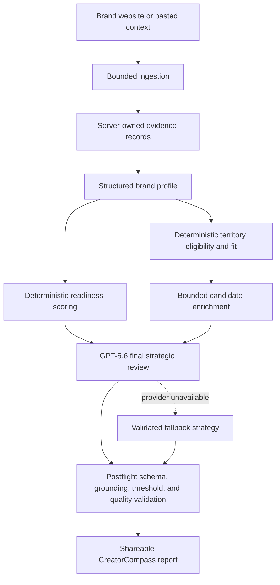

# CreatorCompass

**Discover where your brand belongs in the creator economy.**

CreatorCompass turns one input - a public brand website - into an evidence-backed creator sponsorship strategy. It helps a brand decide which creator communities, campaign formats, and first tests make sense before the brand pays for a creator database or begins outreach.

[Try the live app](https://creatorcompass.neilfoxagency.com/) | [Open the sample report](https://creatorcompass.neilfoxagency.com/reports/sample-neil-fox-agency) | [View a GPT-5.6-reviewed production report](https://creatorcompass.neilfoxagency.com/reports/provided-brand-example-af675cc0)

## OpenAI Build Week submission

| Item | Details |
| --- | --- |
| Category | Work & Productivity |
| Built with | OpenAI Codex and GPT-5.6 |
| Primary Codex `/feedback` Session ID | `019f6c13-ed02-76c1-b025-f2231ba00854` |
| Live application | [creatorcompass.neilfoxagency.com](https://creatorcompass.neilfoxagency.com/) |
| License | MIT |

No account or test credentials are required. A judge can use the hosted application, inspect the deterministic sample report, or open the linked production report that records a successful GPT-5.6 final review.

## The problem

Most creator-marketing platforms begin with creator search. That assumes the brand already knows what kind of creator, audience, format, and campaign it wants.

Many brands are earlier than that. They need to answer:

- Does creator sponsorship make sense for this offer?
- Which creator audiences have real buyer or influence overlap?
- What should the first test look like?
- What must be fixed before outreach?
- Which attractive-looking directions are actually poor fits?

CreatorCompass works upstream of creator databases. It gives the brand a strategic direction before it gives the brand a list of names.

## What the report includes

- A structured brand snapshot grounded in bounded public website evidence
- A product-aware sponsorship-readiness review
- Core creator territories with direct category, use-case, buyer-role, or job-to-be-done support
- Credible adjacent and experimental routes
- Tempting but strategically weak risk zones
- Brand-specific creator profiles, campaign concepts, opening hooks, objections, and risks
- A North Star territory, recommended format, creator direction, and bounded first test
- Five practical next steps
- Visible evidence, assumptions, unknowns, provider provenance, and methodology version

When a website cannot be read, the job enters a `needs-input` state and asks the user to paste brand context. When evidence is insufficient, CreatorCompass abstains from a confident North Star and returns preliminary hypotheses instead of inventing an answer.

## How Codex was used

Codex was the primary implementation collaborator throughout the project, not a one-time code generator. The majority of the project was built in the Codex session identified above.

Codex accelerated the work by helping to:

- Turn the product plan into a TypeScript monorepo
- Build the React and Vite interface and the Hono Worker API
- Implement bounded website ingestion, redirect validation, SSRF protections, and evidence extraction
- Define shared Zod contracts for API, storage, model, and report boundaries
- Build and recalibrate deterministic territory-fit and readiness scoring
- Expand the creator-territory taxonomy for consumer, B2B, SaaS, developer-tool, agency, and creator-economy use cases
- Implement Cloudflare Workers AI, Mistral, and OpenAI provider adapters
- Build the D1, KV, Queue, rate-limit, caching, and job-leasing infrastructure
- Create the accessible report interface, territory compass, share flow, and print-to-PDF layout
- Write unit tests, regression fixtures, evaluation cases, CI checks, and production diagnostics
- Trace bad production reports back to scoring, grounding, taxonomy, and fallback failures
- Deploy the application to Cloudflare and verify fresh production reports

The dated collaboration record is available in [`docs/codex-collaboration.md`](docs/codex-collaboration.md).

## Decisions made by Neil

Codex accelerated implementation, but the central product, quality, and ethical decisions were made by Neil Fox:

- Begin with one input the brand always has: its own website
- Work before creator selection instead of building another creator database
- Submit to Work & Productivity rather than forcing an Education framing
- Separate brand readiness from creator-territory fit
- Keep scoring, thresholds, eligibility, and evidence validation in ordinary code
- Give models a bounded candidate set instead of an open-ended search space
- Require direct evidence for strong territory recommendations
- Allow abstention when the website does not support a confident answer
- Preserve useful deterministic output when a provider fails
- Show provider provenance without turning provider fallback into a user-facing error
- Avoid contact scraping, automated mass outreach, and unsupported ROI claims
- Test recommendations against real brands and treat implausible output as a product defect, even when the report looked polished

This human-model division is central to the implementation. CreatorCompass is designed to preserve user agency and make strategic uncertainty visible.

## How GPT-5.6 is used

GPT-5.6 has a specific runtime role as the final strategic adjudicator.

It does not crawl the website, secretly invent fit scores, or choose from the entire creator economy. The pipeline first creates server-owned evidence, computes deterministic fit, and produces a bounded candidate set. GPT-5.6 then receives structured inputs containing:

- The grounded brand profile
- Product-aware readiness dimensions
- Eligible creator-territory candidates
- Deterministic fit scores and component diagnostics
- Candidate campaign concepts
- Contradictions and unknowns
- Allowed readiness keys and strict portfolio limits

GPT-5.6 must then:

1. Reject weak or incoherent routes.
2. Select only candidates that meet deterministic fit thresholds.
3. Classify the defensible portfolio as Core, Adjacent, Experimental, or Risk.
4. Choose one selected Core territory as the North Star.
5. Produce the campaign format, creator direction, first-test shape, rationale, and fix-first priorities.
6. Return data matching the strict `finalReviewSchema`.

The Worker validates the result again before it can enter a report. A successful OpenAI review is recorded in the report as `aiReview.usedGpt56: true` and `providerPath.finalReview: openai-gpt-5.6`.

GPT-5.6 is therefore used for bounded strategic judgment, while TypeScript owns factual evidence, scoring, thresholds, grounding, and delivery validation. If GPT-5.6 is unavailable, CreatorCompass can still deliver a content-validated deterministic or secondary-provider report, and it records that path honestly.

Relevant implementation files:

- [`apps/worker/src/index.ts`](apps/worker/src/index.ts) - analysis pipeline, provider routing, final review, validation, persistence
- [`packages/ai/src/index.ts`](packages/ai/src/index.ts) - structured model-provider adapters
- [`packages/contracts/src/index.ts`](packages/contracts/src/index.ts) - Zod schemas, including `finalReviewSchema`
- [`packages/scoring/src/index.ts`](packages/scoring/src/index.ts) - deterministic readiness and territory-fit logic

## System flow



The public request returns quickly after D1 persistence and Queue publication. The browser polls named stages while the Queue consumer performs the analysis. Final reports are stored in D1 and cached in KV.

More detail is available in [`docs/architecture.md`](docs/architecture.md), [`docs/ai-pipeline.md`](docs/ai-pipeline.md), and [`docs/security.md`](docs/security.md).

## Technology

- TypeScript
- React and Vite
- Hono
- Cloudflare Workers
- Cloudflare Workers AI
- Cloudflare D1
- Cloudflare KV
- Cloudflare Queues
- OpenAI Responses API with GPT-5.6 Luna
- Mistral API fallback
- Zod
- Vitest
- Wrangler

## Judge testing path

The fastest path does not require rebuilding anything:

1. Open [the live application](https://creatorcompass.neilfoxagency.com/).
2. Enter a public brand website and complete the Turnstile check.
3. Follow the named analysis stages to the report.
4. Inspect the North Star, territory map, readiness review, evidence drawer, and methodology line.
5. Test sharing and browser print-to-PDF.

Notes:

- No account or credentials are required.
- A fresh analysis can take several minutes when external providers are slow.
- If a website blocks server-side access, CreatorCompass requests pasted product or company context.
- The [sample report](https://creatorcompass.neilfoxagency.com/reports/sample-neil-fox-agency) is deterministic and loads immediately.
- This [production report](https://creatorcompass.neilfoxagency.com/reports/provided-brand-example-af675cc0) records a genuine GPT-5.6 final review.

## Repository structure

```text
apps/
  web/                 React and Vite public interface
  worker/              Hono API, Queue consumer, ingestion, persistence, routing
packages/
  ai/                  Structured provider adapters
  contracts/           Shared Zod schemas and TypeScript types
  scoring/             Deterministic readiness and territory-fit engine
  taxonomy/            Curated creator-territory taxonomy
services/
  youtube-fallback/    Optional metadata-only yt-dlp fallback service
fixtures/              Regression and evaluation brand cases
migrations/            D1 database migrations
docs/                  Architecture, security, evaluation, collaboration, and submission docs
outputs/evaluation/    Generated evaluation report
scripts/               Evaluation and verification utilities
```

## Local verification

### Requirements

- Node.js 20 or newer
- pnpm 10.12.1

Clone and install:

```bash
git clone https://github.com/NeilFoxAgency/creator-compass.git
cd creator-compass
corepack enable
pnpm install --frozen-lockfile
```

The deterministic verification path does not require API credentials:

```bash
pnpm typecheck
pnpm test
pnpm eval
pnpm build
pnpm deploy:dry-run
```

The latest committed evaluation report is at [`outputs/evaluation/evaluation.md`](outputs/evaluation/evaluation.md).

### Full local Worker

A full interactive Worker run requires Cloudflare bindings and any model providers you want to exercise.

1. Authenticate Wrangler:

```bash
pnpm exec wrangler login
```

2. Copy the environment template and add secrets locally:

```bash
cp .env.example .dev.vars
```

At minimum, configure the provider keys you intend to test. Never commit `.dev.vars`.

3. Apply D1 migrations locally:

```bash
pnpm exec wrangler d1 migrations apply creator-compass --local
```

4. Build the web application and start Wrangler:

```bash
pnpm dev
```

For a fork or separate deployment, replace the project-specific D1, KV, Queue, route, and Turnstile bindings in `wrangler.jsonc`. Local API testing may use a matching `ADMIN_BYPASS_SECRET` through the `x-creator-compass-admin` header, or a Turnstile site key and verification endpoint valid for the local environment.

## Configuration

The full template is in [`.env.example`](.env.example). Important values include:

| Variable | Purpose | Required |
| --- | --- | --- |
| `OPENAI_API_KEY` | Enables GPT-5.6 final strategic review | Required to test GPT-5.6 |
| `OPENAI_MODEL` | OpenAI model identifier, currently `gpt-5.6-luna` | Defaults in Wrangler |
| `OPENAI_MAX_DAILY_RUNS` | Bounded daily OpenAI review cap | Defaults in Wrangler |
| `CLOUDFLARE_AI_ENABLED` | Enables the native Workers AI path | Optional |
| `CLOUDFLARE_PRIMARY_MODEL` | Structured extraction and enrichment model | Defaults in Wrangler |
| `CLOUDFLARE_REVIEW_MODEL` | Secondary strategic-review model | Defaults in Wrangler |
| `MISTRAL_API_KEY` | Structured extraction, enrichment, and review fallback | Optional |
| `MISTRAL_MODEL` | Mistral model identifier | Defaults in Wrangler |
| `TURNSTILE_VERIFY_URL` | Managed Turnstile verification Worker | Required for public form protection |
| `TURNSTILE_SECRET_KEY` | Legacy direct-siteverify alternative | Use only when no verify URL is configured |
| `ADMIN_BYPASS_SECRET` | Protected local or admin testing path | Optional |
| `REPORT_CACHE_TTL_DAYS` | Report cache duration | Defaults to 30 days |
| `YOUTUBE_API_KEY` | Optional, user-triggered channel exploration | Optional |
| `YTDLP_SERVICE_URL` | Optional metadata-only YouTube fallback | Optional |

## Verification status

Final pre-submission checks reported:

- `pnpm typecheck` - passed
- `pnpm test` - 9 files, 79 tests passed
- `pnpm format:check` - passed
- `pnpm eval` - 9 of 9 cases passed
- `pnpm deploy:dry-run` - passed
- `pnpm build` - passed
- `pnpm audit --audit-level high` - no known vulnerabilities
- Chrome print-to-PDF - 8 pages, no blank pages, readable readiness score
- Fresh production reports - validated for B2B SaaS, SEO software, AI creative software, consumer beauty, local services, and deterministic fallback behavior

The evaluation suite includes positive and negative assertions for OpenSEO, Loova AI, B2B SaaS, open-source developer tools, consumer beauty, physical e-commerce, local services, broad multi-category brands, and insufficient-evidence brands.

## Reliability, security, and cost controls

- At most a small bounded set of public pages is read.
- Raw website HTML is not persisted in the final report.
- URLs and redirects are revalidated before fetching.
- Evidence records remain server-owned and model-returned evidence IDs must resolve to them.
- Model outputs are Zod-validated before entering product state.
- Territory eligibility and scores are deterministic.
- Reports can abstain when the evidence is weak.
- Queue jobs use leases to prevent duplicate deliveries from overwriting one another.
- Turnstile, IP limits, domain cooldowns, caching, and provider caps control public abuse and cost.
- Provider failure does not automatically become a user-facing product error.
- No automated mass outreach, contact scraping, or creator-payment functionality is included.

## Known limitation

The native Workers AI binding does not expose request cancellation. A fresh website analysis can therefore be slow when a Workers AI call stalls. Queue leasing prevents duplicate concurrent execution, secondary providers and deterministic logic preserve report availability, and pasted-context continuation avoids unnecessary model extraction.

## Additional documentation

- [`docs/codex-collaboration.md`](docs/codex-collaboration.md) - Codex contribution and Neil's decisions
- [`docs/architecture.md`](docs/architecture.md) - system and failure boundaries
- [`docs/ai-pipeline.md`](docs/ai-pipeline.md) - model roles and fallback order
- [`docs/evaluation.md`](docs/evaluation.md) - evaluation strategy
- [`docs/security.md`](docs/security.md) - threat boundaries and secret handling
- [`docs/production-quality-review.md`](docs/production-quality-review.md) - production findings and final verification
- [`docs/contest-compliance.md`](docs/contest-compliance.md) - Build Week requirement map

## License

CreatorCompass is released under the [MIT License](LICENSE).
